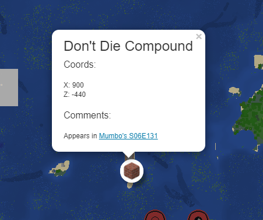

# HermitcraftMap
Easily browse maps for all Hermitcraft seasons!

Live at [https://saadbruno.github.io/hermitcraftmap/](https://saadbruno.github.io/hermitcraftmap/)


## POI



The map supports POI (Points of Interest)!

Points of interest for each season should be listed at the respective `data/hc<season>/poi.json`. You can refer to the [Season 6 POI](data/hc6/poi.json) file as an example.

Contributing to this is **highly encouraged**!

The structure is as follows:
```
{
    "title": "Title Goes Here",
    "coordX": 111,
    "coordY": 222,
    "coordZ": 333,
    "comment": "Description of the POI. This supports <b>HTML</b> (including <a href='https://youtube.com'>links</a>",
    "icon_url": "https://saadbruno.github.io/hermitcraftmap/img/mcmap_i_c.svg"
}
```

## Roadmap:
- Add other dimensions such as the Nether and the End. Currently limited by [MinedMap](https://github.com/NeoRaider/MinedMap), since it doesn't generate maps for those dimensions.

## Development:
To run this locally, you just need a web server. It doesn't require any other kind of server side rendering technology. Just run a localhost server and navigate to `index.html`.

## Links
This project wouldn't be possible without:
- [MinedMap](https://github.com/NeoRaider/MinedMap)
- [Leaflet](https://github.com/Leaflet/Leaflet)
